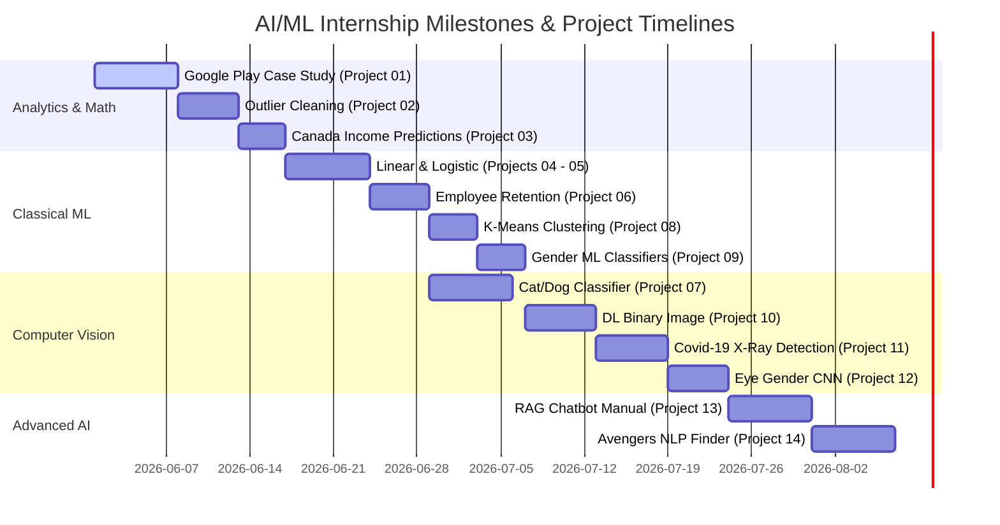

<!-- HERO SECTION -->

  

  <b>A premium showcase of advanced AI, Machine Learning, Deep Learning, Natural Language Processing, Computer Vision, and Generative AI projects built during my summer internship.</b>

<!-- HERO BADGES -->

  
  
  
  
  
   
  
  
  
  
  
   
  
  
  
  

<!-- GRADIENT SEPARATOR -->

  <rect width='1200' height='6' fill='url(%23g)' rx='3'/><linearGradient id='g' x1='0' y1='0' x2='1200' y2='0' gradientUnits='userSpaceOnUse'><stop stop-color='%2360A5FA'/><stop offset='0.5' stop-color='%239B51E0'/><stop offset='1' stop-color='%2300C853'/></linearGradient></svg>" width="100%" />

<!-- NAVIGATION BAR -->

  
  
  
  
  
  
  

<!-- GRADIENT SEPARATOR -->

  <rect width='1200' height='6' fill='url(%23g)' rx='3'/><linearGradient id='g' x1='0' y1='0' x2='1200' y2='0' gradientUnits='userSpaceOnUse'><stop stop-color='%2360A5FA'/><stop offset='0.5' stop-color='%239B51E0'/><stop offset='1' stop-color='%2300C853'/></linearGradient></svg>" width="100%" />

<!-- ABOUT SECTION -->
## 🤖 About The Internship

This repository showcases a curated selection of advanced industry-oriented projects completed during my **Artificial Intelligence Summer Internship**. The curriculum covers data analytics, statistical modeling, machine learning, deep learning, computer vision, natural language processing, and modern retrieval techniques. 

To bridge the gap between model training and real-world deployment, many of the projects have been packed into interactive, responsive frontend interfaces and deployed live via **Streamlit Cloud**.

<!-- GRADIENT SEPARATOR -->

  <rect width='1200' height='6' fill='url(%23g)' rx='3'/><linearGradient id='g' x1='0' y1='0' x2='1200' y2='0' gradientUnits='userSpaceOnUse'><stop stop-color='%2360A5FA'/><stop offset='0.5' stop-color='%239B51E0'/><stop offset='1' stop-color='%2300C853'/></linearGradient></svg>" width="100%" />

<!-- TECH STACK SECTION -->
## 🛠️ Tech Stack

  <!-- Languages -->
  
  <!-- AI / ML Frameworks -->
  
  
  
  
   
  <!-- Data Science -->
  
  
  
  <!-- Front End / Deployments -->
  
  <!-- Developer Tools -->
  
  
  
   
  
  

<!-- GRADIENT SEPARATOR -->

  <rect width='1200' height='6' fill='url(%23g)' rx='3'/><linearGradient id='g' x1='0' y1='0' x2='1200' y2='0' gradientUnits='userSpaceOnUse'><stop stop-color='%2360A5FA'/><stop offset='0.5' stop-color='%239B51E0'/><stop offset='1' stop-color='%2300C853'/></linearGradient></svg>" width="100%" />

<!-- PROJECTS SECTION -->
## 🚀 Featured Projects

<table width="100%" style="border-collapse: collapse;">
  <!-- ROW 1: Project 01 & Project 02 -->
  <tr>
    <td width="50%" valign="top" align="center" style="padding: 15px; border: 1px solid #1E293B;">
      
      <h3 align="center">📊 Project 01 - Google Play Store Case Study</h3>
      

        
        
        
      

      
Exploratory Data Analysis (EDA) of the Google Play Store dataset to identify key market trends, application categories, and user rating patterns that drive app success.

      

        
<b>🔍 Key Features & Details</b>

        

          • Thorough data cleaning and preprocessing of millions of rows. 
          • Visual distribution analysis using Matplotlib & Seaborn. 
          • Correlation studies between download volume, app size, and average ratings.
        

      

       
      

        
        
      

    </td>
    <td width="50%" valign="top" align="center" style="padding: 15px; border: 1px solid #1E293B;">
      
      <h3 align="center">🧹 Project 02 - Outlier Detection and Removal</h3>
      

        
        
        
      

      
Implementation of various statistics-based techniques to detect and eliminate outliers in continuous datasets, enhancing model accuracy and regression robustness.

      

        
<b>🔍 Key Features & Details</b>

        

          • Standard Deviation and Z-Score outlier removal filters. 
          • Interquartile Range (IQR) threshold boundary methods. 
          • Comparative visualizations of pre/post-cleaning distributions.
        

      

       
      

        
        
      

    </td>
  </tr>

  <!-- ROW 2: Project 03 & Project 04 -->
  <tr>
    <td width="50%" valign="top" align="center" style="padding: 15px; border: 1px solid #1E293B;">
      
      <h3 align="center">📈 Project 03 - Canada Per Capita Income Prediction</h3>
      

        
        
      

      
A predictive linear model designed to forecast Canada's future per capita income based on historical data using linear regression modeling.

      

        
<b>🔍 Key Features & Details</b>

        

          • Single-variable regression mapping time to economic growth. 
          • Trend analysis and feature scaling pipelines. 
          • Future income projections with confidence intervals.
        

      

       
      

        
        
      

    </td>
    <td width="50%" valign="top" align="center" style="padding: 15px; border: 1px solid #1E293B;">
      
      <h3 align="center">🚀 Project 04 Linear Regression</h3>
      

        
        
      

      
Web-based deployment of a Linear Regression model for predicting target continuous variables using custom feature inputs in real-time.

      

        
<b>🔍 Key Features & Details</b>

        

          • Fully interactive sliders for custom regression inputs. 
          • Real-time model inference and immediate updates. 
          • Interactive visualization of the fitted regression line.
        

      

       
      

        
        
      

    </td>
  </tr>

  <!-- ROW 3: Project 05 & Project 06 -->
  <tr>
    <td width="50%" valign="top" align="center" style="padding: 15px; border: 1px solid #1E293B;">
      
      <h3 align="center">🎯 Project 05 - Logistic Regression</h3>
      

        
        
        
      

      
An interactive classification dashboard deploying a Logistic Regression model to predict binary outcomes based on user-provided inputs.

      

        
<b>🔍 Key Features & Details</b>

        

          • Interactive prediction threshold adjusting slide-bars. 
          • Probability distribution charts and classification metrics. 
          • Decision boundaries dynamically plotted on dashboard.
        

      

       
      

        
        
      

    </td>
    <td width="50%" valign="top" align="center" style="padding: 15px; border: 1px solid #1E293B;">
      
      <h3 align="center">💼 Project 06- Employee Retention</h3>
      

        
        
        
      

      
Predictive HR model engineered to forecast the probability of employee attrition using job satisfaction levels, evaluation scores, and work metrics.

      

        
<b>🔍 Key Features & Details</b>

        

          • Dynamic attrition probability gauge visualizer. 
          • Breakdown analysis of key factors influencing employee turnover. 
          • User interface tailored for enterprise HR management tools.
        

      

       
      

        
        
      

    </td>
  </tr>

  <!-- ROW 4: Project 07 & Project 08 -->
  <tr>
    <td width="50%" valign="top" align="center" style="padding: 15px; border: 1px solid #1E293B;">
      
      <h3 align="center">🐱 Project 07 - Cat and Dog Image Classifier</h3>
      

        
        
        
      

      
Computer Vision application that uses a deep learning classifier to distinguish between uploaded images of cats and dogs.

      

        
<b>🔍 Key Features & Details</b>

        

          • Drag-and-drop user uploads for prompt inference. 
          • Clean, styled gauge presenting prediction confidence. 
          • Deep learning pipeline leveraging convolutional networks.
        

      

       
      

        
        
      

    </td>
    <td width="50%" valign="top" align="center" style="padding: 15px; border: 1px solid #1E293B;">
      
      <h3 align="center">🧩 Project 08 - K-Means Clustering</h3>
      

        
        
        
      

      
Interactive Unsupervised Learning dashboard allowing users to perform and visualize K-Means clustering dynamically on continuous datasets.

      

        
<b>🔍 Key Features & Details</b>

        

          • Adjustable slider to specify the cluster count (K) in real-time. 
          • Interactive 2D scatter plots mapping cluster segments. 
          • Automated calculation of cluster centroids and SSE metrics.
        

      

       
      

        
        
      

    </td>
  </tr>

  <!-- ROW 5: Project 09 & Project 10 -->
  <tr>
    <td width="50%" valign="top" align="center" style="padding: 15px; border: 1px solid #1E293B;">
      
      <h3 align="center">👤 Project 09 - Gender Classification using Machine Learning</h3>
      

        
        
        
      

      
Classification dashboard leveraging machine learning algorithms to predict gender profiles based on custom physical metrics.

      

        
<b>🔍 Key Features & Details</b>

        

          • Multi-input controls for body and physical measurement metrics. 
          • Instant model inference with clean output tags. 
          • Transparent metric breakdown of features used.
        

      

       
      

        
        
      

    </td>
    <td width="50%" valign="top" align="center" style="padding: 15px; border: 1px solid #1E293B;">
      
      <h3 align="center">🖼️ Project 10 - Binary Image Classifier using Deep Learning</h3>
      

        
        
      

      
Deep Learning application built on convolutional layers to perform binary image categorization on customizable image classes.

      

        
<b>🔍 Key Features & Details</b>

        

          • Dynamic configuration supporting variable binary classes. 
          • User-friendly drag-and-drop local image uploading. 
          • Interactive visualization of neural network layer activations.
        

      

       
      

        
        
      

    </td>
  </tr>

  <!-- ROW 6: Project 11 & Project 12 -->
  <tr>
    <td width="50%" valign="top" align="center" style="padding: 15px; border: 1px solid #1E293B;">
      
      <h3 align="center">🏥 Project 11 - Covid-19 Detection System from Image</h3>
      

        
        
        
      

      
Medical imaging diagnostic application leveraging Deep Learning to classify chest X-ray images into COVID-19 positive or negative cases.

      

        
<b>🔍 Key Features & Details</b>

        

          • Real-time classification of medical chest X-ray scans. 
          • Confidence breakdown metrics and high-accuracy logs. 
          • Integrated guidelines and professional health disclaimers.
        

      

       
      

        
        
      

    </td>
    <td width="50%" valign="top" align="center" style="padding: 15px; border: 1px solid #1E293B;">
      
      <h3 align="center">👁️ Project 12 - Eye Gender Detection using CNN</h3>
      

        
        
        
      

      
High-accuracy Convolutional Neural Network (CNN) application designed to classify gender based on close-up crop images of human eyes.

      

        
<b>🔍 Key Features & Details</b>

        

          • Automated eye ROI preprocessing pipeline. 
          • High accuracy and rapid classification response. 
          • Streamlit caching optimizations to load trained models efficiently.
        

      

       
      

        
        
      

    </td>
  </tr>

  <!-- ROW 7: Project 13 & Project 14 -->
  <tr>
    <td width="50%" valign="top" align="center" style="padding: 15px; border: 1px solid #1E293B;">
      
      <h3 align="center">🤖 project 13 - RAG_Based_ChatBot_of_Samsung_Washing_machine</h3>
      

        
        
        
      

      
Advanced Retrieval-Augmented Generation (RAG) chatbot that reads technical documentation to answer user queries precisely.

      

        
<b>🔍 Key Features & Details</b>

        

          • Dynamic context retrieval from technical PDF manuals. 
          • High accuracy queries backed by Google Gemini and vector embeddings. 
          • Fully interactive conversational memory in Streamlit interface.
        

      

       
      

        
        
      

    </td>
    <td width="50%" valign="top" align="center" style="padding: 15px; border: 1px solid #1E293B;">
      
      <h3 align="center">🎬 Project 14 -Avengers Endgame Review Finder</h3>
      

        
        
        
      

      
Interactive sentiment analyzer and keyword extraction tool parsing viewer reviews for the film <i>Avengers: Endgame</i>.

      

        
<b>🔍 Key Features & Details</b>

        

          • Direct keyword searching in reviews databases. 
          • Distribution graphs of review sentiments (positive/negative/neutral). 
          • User interface with movie themes and interactive statistics charts.
        

      

       
      

        
        
      

    </td>
  </tr>
</table>

<!-- GRADIENT SEPARATOR -->

  <rect width='1200' height='6' fill='url(%23g)' rx='3'/><linearGradient id='g' x1='0' y1='0' x2='1200' y2='0' gradientUnits='userSpaceOnUse'><stop stop-color='%2360A5FA'/><stop offset='0.5' stop-color='%239B51E0'/><stop offset='1' stop-color='%2300C853'/></linearGradient></svg>" width="100%" />

<!-- REPOSITORY HIGHLIGHTS SECTION -->
## 📊 Repository Highlights

<table align="center" width="100%">
  <tr>
    <td align="center" width="25%" style="padding: 10px; border: 1px solid #1E293B;">
      <h3>🚀 14+ Projects</h3>
      
Hands-on AI & ML implementations

    </td>
    <td align="center" width="25%" style="padding: 10px; border: 1px solid #1E293B;">
      <h3>🧠 Machine Learning</h3>
      
Regression, Classification & Clustering

    </td>
    <td align="center" width="25%" style="padding: 10px; border: 1px solid #1E293B;">
      <h3>🔮 Deep Learning</h3>
      
Neural Networks & CNNs

    </td>
    <td align="center" width="25%" style="padding: 10px; border: 1px solid #1E293B;">
      <h3>👁️ Computer Vision</h3>
      
Image Classifiers & Detection

    </td>
  </tr>
  <tr>
    <td align="center" width="25%" style="padding: 10px; border: 1px solid #1E293B;">
      <h3>💬 NLP & RAG</h3>
      
Chatbots & Review Finders

    </td>
    <td align="center" width="25%" style="padding: 10px; border: 1px solid #1E293B;">
      <h3>⚡ Live Deployments</h3>
      
Interactive Streamlit Apps

    </td>
    <td align="center" width="25%" style="padding: 10px; border: 1px solid #1E293B;">
      <h3>🌟 Open Source</h3>
      
Fully documented & open code

    </td>
    <td align="center" width="25%" style="padding: 10px; border: 1px solid #1E293B;">
      <h3>💼 Internship Portfolio</h3>
      
Industrial AI/ML Training

    </td>
  </tr>
</table>

<!-- GRADIENT SEPARATOR -->

  <rect width='1200' height='6' fill='url(%23g)' rx='3'/><linearGradient id='g' x1='0' y1='0' x2='1200' y2='0' gradientUnits='userSpaceOnUse'><stop stop-color='%2360A5FA'/><stop offset='0.5' stop-color='%239B51E0'/><stop offset='1' stop-color='%2300C853'/></linearGradient></svg>" width="100%" />

<!-- SKILLS PROGRESS SECTION -->
## 🎯 Core Technical Skills

<table align="center" width="100%" style="border-collapse: collapse;">
  <tr>
    <td width="50%" style="padding: 10px; border: none;">
        
        
        
        
      
    </td>
    <td width="50%" style="padding: 10px; border: none;">
        
        
        
        
      
    </td>
  </tr>
</table>

<!-- GRADIENT SEPARATOR -->

  <rect width='1200' height='6' fill='url(%23g)' rx='3'/><linearGradient id='g' x1='0' y1='0' x2='1200' y2='0' gradientUnits='userSpaceOnUse'><stop stop-color='%2360A5FA'/><stop offset='0.5' stop-color='%239B51E0'/><stop offset='1' stop-color='%2300C853'/></linearGradient></svg>" width="100%" />

<!-- INTERNSHIP JOURNEY TIMELINE -->
## 📅 Internship Journey

### 🏁 Milestone Log & Progression:
* **Milestone 1**: 📊 Data Analysis & Wrangling (**Project 01**)
* **Milestone 2**: 🧹 Advanced Preprocessing & Outlier Handling (**Project 02**)
* **Milestone 3**: 📉 Predictive Mathematical Modeling (**Project 03**)
* **Milestone 4**: 🚀 Web Deployment of ML Regressors (**Projects 04 - 06**)
* **Milestone 5**: 🧠 Unsupervised Learning & Clustering (**Project 08**)
* **Milestone 6**: 🎯 Machine Learning Classifiers (**Project 09**)
* **Milestone 7**: 🖼️ Convolutional Neural Networks & DL (**Projects 07, 10 - 12**)
* **Milestone 8**: 🤖 Retrieval-Augmented Generation (RAG) (**Project 13**)
* **Milestone 9**: 🍿 Advanced NLP & Review Extraction (**Project 14**)

<!-- GRADIENT SEPARATOR -->

  <rect width='1200' height='6' fill='url(%23g)' rx='3'/><linearGradient id='g' x1='0' y1='0' x2='1200' y2='0' gradientUnits='userSpaceOnUse'><stop stop-color='%2360A5FA'/><stop offset='0.5' stop-color='%239B51E0'/><stop offset='1' stop-color='%2300C853'/></linearGradient></svg>" width="100%" />

<!-- GITHUB ANALYTICS SECTION -->
## 📈 GitHub Analytics

<table align="center" width="100%">
  <tr>
    <td align="center" width="50%" style="border: none;">
      
    </td>
    <td align="center" width="50%" style="border: none;">
      
    </td>
  </tr>
  <tr>
    <td align="center" width="50%" style="border: none;">
      
    </td>
    <td align="center" width="50%" style="border: none;">
      
    </td>
  </tr>
</table>

### 🐍 GitHub Contribution Snake

  

<!-- GRADIENT SEPARATOR -->

  <rect width='1200' height='6' fill='url(%23g)' rx='3'/><linearGradient id='g' x1='0' y1='0' x2='1200' y2='0' gradientUnits='userSpaceOnUse'><stop stop-color='%2360A5FA'/><stop offset='0.5' stop-color='%239B51E0'/><stop offset='1' stop-color='%2300C853'/></linearGradient></svg>" width="100%" />

<!-- CONTACT SECTION -->
## ✉️ Connect With Me

  
  
  
  

<!-- FOOTER -->

  

  <b>Made with ❤️ by Ankit Yadav</b>

